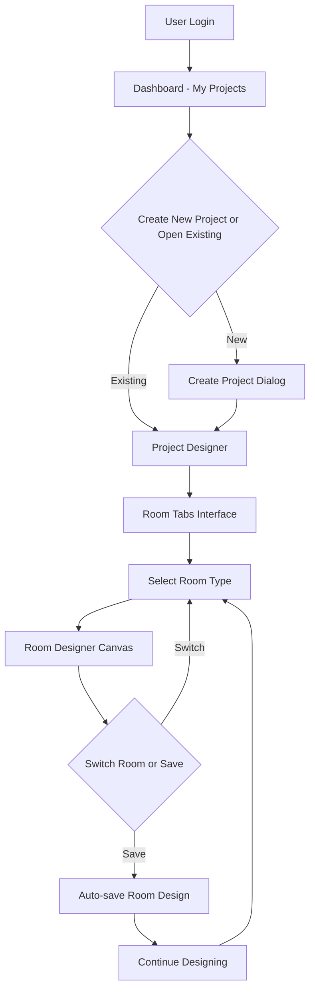
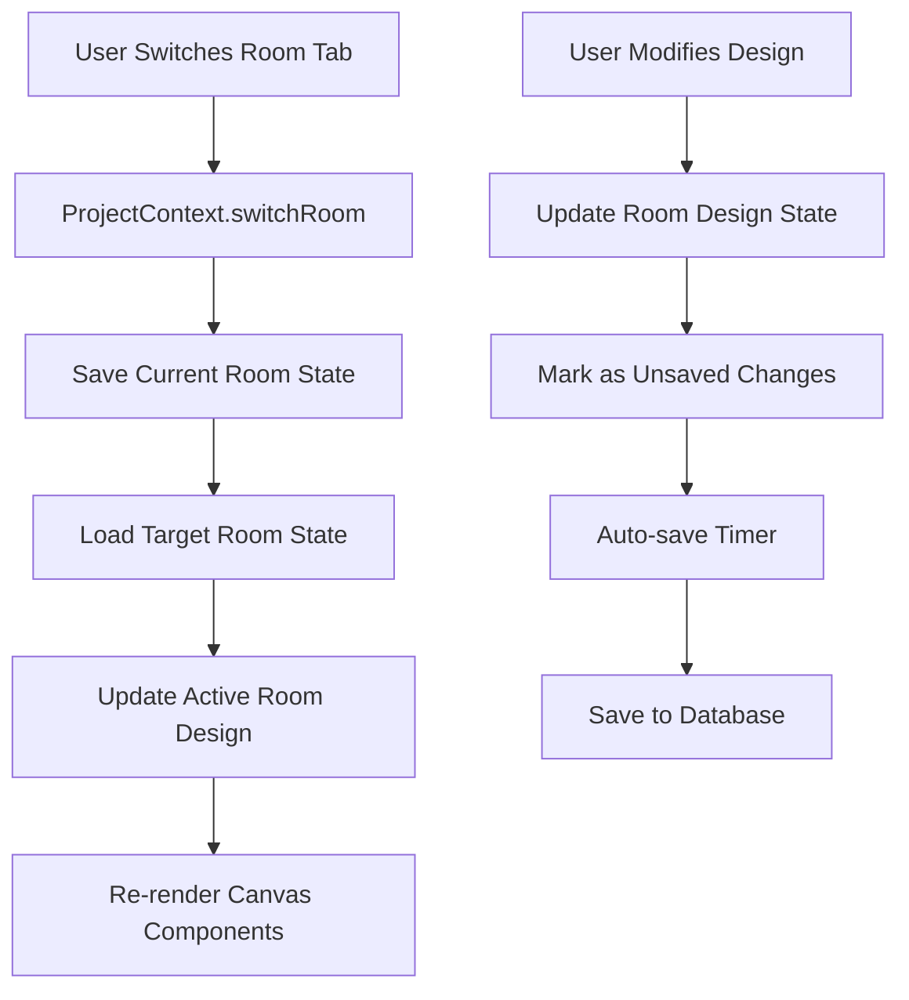

# Multi-Room Project Architecture - RightFit Interior Designer

**Document Version**: 1.0  
**Created**: September 8, 2025  
**Status**: Architecture Design Phase  

---

## 🎯 **Problem Statement**

**Current Issue**: The application currently treats room types as simple categories, where switching room types just changes the component library but uses the same design canvas. Users cannot create independent designs for different rooms within a single project.

**Required Solution**: Users need to create **projects** that contain multiple independent room designs (Kitchen, Bedroom, Bathroom, etc.), where each room has its own design canvas, elements, and state.

---

## 🏗️ **Proposed Architecture**

### **Conceptual Model**

```mermaid
graph TD
    A[User] --> B[Projects]
    B --> C[Project: "My Home Design"]
    C --> D[Kitchen Design]
    C --> E[Bedroom Design]
    C --> F[Bathroom Design]
    C --> G[Living Room Design]
    C --> H[Dining Room Design]
    C --> I[Utility Design]
    C --> J[Under-Stairs Design]
    
    D --> D1[Elements]
    D --> D2[Room Dimensions]
    D --> D3[Design State]
    
    E --> E1[Elements]
    E --> E2[Room Dimensions]
    E --> E3[Design State]
```

### **Data Hierarchy**

```
User
└── Projects (1:many)
    └── Room Designs (1:many)
        ├── Elements (1:many)
        ├── Room Dimensions
        ├── Design Metadata
        └── Room-specific Settings
```

---

## 🗄️ **Database Schema Design**

### **New Schema Structure**

```sql
-- Projects table (replaces current designs table concept)
CREATE TABLE public.projects (
  id UUID NOT NULL DEFAULT gen_random_uuid() PRIMARY KEY,
  user_id UUID NOT NULL REFERENCES auth.users(id) ON DELETE CASCADE,
  name TEXT NOT NULL,
  description TEXT,
  thumbnail_url TEXT,
  is_public BOOLEAN NOT NULL DEFAULT false,
  created_at TIMESTAMP WITH TIME ZONE NOT NULL DEFAULT now(),
  updated_at TIMESTAMP WITH TIME ZONE NOT NULL DEFAULT now()
);

-- Room designs table (individual room designs within projects)
CREATE TABLE public.room_designs (
  id UUID NOT NULL DEFAULT gen_random_uuid() PRIMARY KEY,
  project_id UUID NOT NULL REFERENCES public.projects(id) ON DELETE CASCADE,
  room_type TEXT NOT NULL CHECK (room_type IN (
    'kitchen', 'bedroom', 'bathroom', 'living-room', 
    'dining-room', 'utility', 'under-stairs'
  )),
  name TEXT, -- Optional custom name for the room
  room_dimensions JSONB NOT NULL DEFAULT '{"width": 400, "height": 300}',
  design_elements JSONB NOT NULL DEFAULT '[]',
  design_settings JSONB NOT NULL DEFAULT '{}', -- Room-specific settings
  created_at TIMESTAMP WITH TIME ZONE NOT NULL DEFAULT now(),
  updated_at TIMESTAMP WITH TIME ZONE NOT NULL DEFAULT now(),
  
  -- Ensure one room design per room type per project
  UNIQUE(project_id, room_type)
);

-- Migration strategy for existing data
CREATE TABLE public.designs_backup AS SELECT * FROM public.designs;

-- Indexes for performance
CREATE INDEX idx_projects_user_id ON public.projects(user_id);
CREATE INDEX idx_projects_public ON public.projects(is_public) WHERE is_public = true;
CREATE INDEX idx_room_designs_project_id ON public.room_designs(project_id);
CREATE INDEX idx_room_designs_room_type ON public.room_designs(room_type);
CREATE INDEX idx_room_designs_project_room ON public.room_designs(project_id, room_type);
```

### **Row Level Security (RLS) Policies**

```sql
-- Enable RLS
ALTER TABLE public.projects ENABLE ROW LEVEL SECURITY;
ALTER TABLE public.room_designs ENABLE ROW LEVEL SECURITY;

-- Projects policies
CREATE POLICY "Users can view their own projects and public projects" 
ON public.projects FOR SELECT 
USING (auth.uid() = user_id OR is_public = true);

CREATE POLICY "Users can create their own projects" 
ON public.projects FOR INSERT 
WITH CHECK (auth.uid() = user_id);

CREATE POLICY "Users can update their own projects" 
ON public.projects FOR UPDATE 
USING (auth.uid() = user_id);

CREATE POLICY "Users can delete their own projects" 
ON public.projects FOR DELETE 
USING (auth.uid() = user_id);

-- Room designs policies
CREATE POLICY "Users can view room designs of their projects and public projects" 
ON public.room_designs FOR SELECT 
USING (
  EXISTS (
    SELECT 1 FROM public.projects 
    WHERE projects.id = room_designs.project_id 
    AND (projects.user_id = auth.uid() OR projects.is_public = true)
  )
);

CREATE POLICY "Users can create room designs for their projects" 
ON public.room_designs FOR INSERT 
WITH CHECK (
  EXISTS (
    SELECT 1 FROM public.projects 
    WHERE projects.id = room_designs.project_id 
    AND projects.user_id = auth.uid()
  )
);

CREATE POLICY "Users can update room designs of their projects" 
ON public.room_designs FOR UPDATE 
USING (
  EXISTS (
    SELECT 1 FROM public.projects 
    WHERE projects.id = room_designs.project_id 
    AND projects.user_id = auth.uid()
  )
);

CREATE POLICY "Users can delete room designs of their projects" 
ON public.room_designs FOR DELETE 
USING (
  EXISTS (
    SELECT 1 FROM public.projects 
    WHERE projects.id = room_designs.project_id 
    AND projects.user_id = auth.uid()
  )
);
```

---

## 🔧 **Application Architecture Changes**

### **New Data Models**

```typescript
// Updated interfaces
export interface Project {
  id: string;
  user_id: string;
  name: string;
  description?: string;
  thumbnail_url?: string;
  is_public: boolean;
  created_at: string;
  updated_at: string;
  room_designs?: RoomDesign[]; // Populated when needed
}

export interface RoomDesign {
  id: string;
  project_id: string;
  room_type: RoomType;
  name?: string; // Custom room name
  room_dimensions: { width: number; height: number };
  design_elements: DesignElement[];
  design_settings: RoomDesignSettings;
  created_at: string;
  updated_at: string;
}

export interface RoomDesignSettings {
  // Room-specific settings
  default_wall_height?: number;
  floor_material?: string;
  wall_color?: string;
  lighting_settings?: LightingSettings;
  view_preferences?: ViewPreferences;
}

export type RoomType = 
  | 'kitchen' 
  | 'bedroom' 
  | 'bathroom' 
  | 'living-room' 
  | 'dining-room' 
  | 'utility' 
  | 'under-stairs';
```

### **Updated Component Structure**

```
src/
├── pages/
│   ├── Dashboard.tsx           # Project management
│   ├── ProjectDesigner.tsx     # Multi-room project interface (NEW)
│   └── RoomDesigner.tsx        # Individual room designer (UPDATED)
├── components/
│   ├── project/                # NEW - Project management components
│   │   ├── ProjectCard.tsx
│   │   ├── ProjectCreator.tsx
│   │   ├── RoomTabs.tsx
│   │   └── RoomOverview.tsx
│   └── designer/               # Updated for room-specific design
│       ├── DesignCanvas2D.tsx  # Updated to work with RoomDesign
│       ├── View3D.tsx          # Updated to work with RoomDesign
│       └── ...
├── hooks/
│   ├── useProject.ts           # NEW - Project management
│   ├── useRoomDesign.ts        # NEW - Room design management
│   └── useMultiRoomState.ts    # NEW - Multi-room state management
└── contexts/
    └── ProjectContext.tsx      # NEW - Project-wide state
```

---

## 🚀 **Implementation Plan**

### **Phase 1: Database Migration & Core Models**

#### **Step 1.1: Create New Tables**
```sql
-- File: supabase/migrations/20250908160000_create_multi_room_schema.sql
-- Create projects and room_designs tables
-- Set up RLS policies
-- Create indexes
```

#### **Step 1.2: Data Migration Strategy**
```sql
-- File: supabase/migrations/20250908160001_migrate_existing_designs.sql
-- Convert existing designs to projects with single room designs
-- Preserve all existing data
-- Update foreign key relationships
```

#### **Step 1.3: Update TypeScript Interfaces**
```typescript
// File: src/types/project.ts
// Define new Project and RoomDesign interfaces
// Update existing DesignElement interface if needed
```

### **Phase 2: Core Application Updates**

#### **Step 2.1: Create Project Management System**
- **ProjectContext**: Global project state management
- **useProject hook**: Project CRUD operations
- **useRoomDesign hook**: Room design CRUD operations
- **Project Dashboard**: List and manage projects

#### **Step 2.2: Update Designer Interface**
- **ProjectDesigner**: Main multi-room interface with tabs
- **RoomDesigner**: Individual room design interface
- **Room Tabs**: Switch between different rooms in a project
- **Room State Isolation**: Ensure each room has independent state

#### **Step 2.3: Update Existing Components**
- **DesignCanvas2D**: Work with RoomDesign instead of Design
- **View3D**: Work with RoomDesign instead of Design
- **ComponentLibrary**: Room-specific component filtering
- **PropertiesPanel**: Room-specific property management

### **Phase 3: Enhanced Features**

#### **Step 3.1: Room Templates**
- Default room configurations for each room type
- Quick room setup with standard dimensions
- Room-specific component presets

#### **Step 3.2: Project-Wide Features**
- Project overview with all rooms
- Cross-room element copying
- Project export functionality
- Project sharing and collaboration

---

## 🔄 **User Experience Flow**

### **New User Journey**



### **Key UX Improvements**

1. **Project-Centric Workflow**: Users think in terms of "projects" not individual designs
2. **Room Tabs**: Easy switching between rooms within a project
3. **Independent State**: Each room maintains its own design state
4. **Auto-Save**: Automatic saving of room designs as users switch
5. **Visual Progress**: Show which rooms have been designed in the project

---

## 📊 **State Management Architecture**

### **Context Structure**

```typescript
// ProjectContext structure
interface ProjectContextType {
  // Current project
  currentProject: Project | null;
  
  // All room designs for current project
  roomDesigns: Map<RoomType, RoomDesign>;
  
  // Currently active room
  activeRoomType: RoomType;
  activeRoomDesign: RoomDesign | null;
  
  // Actions
  loadProject: (projectId: string) => Promise<void>;
  createProject: (project: Omit<Project, 'id'>) => Promise<Project>;
  updateProject: (updates: Partial<Project>) => Promise<void>;
  
  switchRoom: (roomType: RoomType) => void;
  updateRoomDesign: (roomType: RoomType, updates: Partial<RoomDesign>) => Promise<void>;
  createRoomDesign: (roomType: RoomType, roomDesign: Omit<RoomDesign, 'id'>) => Promise<void>;
  
  // State flags
  isLoading: boolean;
  hasUnsavedChanges: boolean;
}
```

### **Data Flow**



---

## 🔧 **Technical Implementation Details**

### **Database Queries**

```typescript
// Load project with all room designs
const loadProjectWithRooms = async (projectId: string): Promise<Project> => {
  const { data: project } = await supabase
    .from('projects')
    .select(`
      *,
      room_designs (*)
    `)
    .eq('id', projectId)
    .single();
    
  return project;
};

// Update specific room design
const updateRoomDesign = async (
  roomDesignId: string, 
  updates: Partial<RoomDesign>
): Promise<void> => {
  await supabase
    .from('room_designs')
    .update(updates)
    .eq('id', roomDesignId);
};

// Create room design for project
const createRoomDesign = async (
  projectId: string,
  roomType: RoomType,
  roomDesign: Omit<RoomDesign, 'id' | 'project_id'>
): Promise<RoomDesign> => {
  const { data } = await supabase
    .from('room_designs')
    .insert({
      project_id: projectId,
      room_type: roomType,
      ...roomDesign
    })
    .select()
    .single();
    
  return data;
};
```

### **Component Updates**

```typescript
// Updated Designer component
const ProjectDesigner: React.FC = () => {
  const { currentProject, activeRoomDesign, switchRoom } = useProject();
  const [activeTab, setActiveTab] = useState<RoomType>('kitchen');
  
  const handleRoomSwitch = async (roomType: RoomType) => {
    await switchRoom(roomType);
    setActiveTab(roomType);
  };
  
  return (
    <div className="project-designer">
      <RoomTabs 
        activeRoom={activeTab}
        onRoomChange={handleRoomSwitch}
        availableRooms={ROOM_TYPES}
      />
      
      <RoomDesigner 
        roomDesign={activeRoomDesign}
        roomType={activeTab}
      />
    </div>
  );
};
```

---

## 🚦 **Migration Strategy**

### **Backward Compatibility**

1. **Preserve Existing Data**: All current designs will be migrated to projects
2. **API Compatibility**: Maintain existing API endpoints during transition
3. **Gradual Migration**: Users can continue using existing designs while new projects use the new system

### **Migration Steps**

```sql
-- Step 1: Create new tables alongside existing ones
-- Step 2: Migrate existing designs to projects
INSERT INTO public.projects (user_id, name, description)
SELECT DISTINCT user_id, 
       COALESCE(name, 'Migrated Project') as name,
       'Migrated from legacy design system' as description
FROM public.designs;

-- Step 3: Create room designs from existing designs
INSERT INTO public.room_designs (project_id, room_type, room_dimensions, design_elements)
SELECT p.id as project_id,
       d.room_type,
       jsonb_build_object('width', 
         COALESCE((d.design_data->>'roomDimensions')::jsonb->>'width', '400')::int,
         'height', 
         COALESCE((d.design_data->>'roomDimensions')::jsonb->>'height', '300')::int
       ) as room_dimensions,
       COALESCE(d.design_data->'elements', '[]'::jsonb) as design_elements
FROM public.designs d
JOIN public.projects p ON p.user_id = d.user_id;

-- Step 4: Verify migration
-- Step 5: Drop old tables (after verification)
```

---

## 📋 **Implementation Checklist**

### **Database Changes**
- [ ] Create projects table
- [ ] Create room_designs table  
- [ ] Set up RLS policies
- [ ] Create indexes
- [ ] Write migration scripts
- [ ] Test migration with sample data

### **Application Changes**
- [ ] Update TypeScript interfaces
- [ ] Create ProjectContext
- [ ] Create useProject hook
- [ ] Create useRoomDesign hook
- [ ] Update Designer.tsx to ProjectDesigner.tsx
- [ ] Create RoomTabs component
- [ ] Update DesignCanvas2D for room designs
- [ ] Update View3D for room designs
- [ ] Update ComponentLibrary for room filtering
- [ ] Create project dashboard
- [ ] Add room templates

### **Testing & Validation**
- [ ] Test room switching functionality
- [ ] Test state isolation between rooms
- [ ] Test auto-save functionality
- [ ] Test project creation and management
- [ ] Test migration of existing data
- [ ] Performance testing with multiple rooms

---

## 🎯 **Success Criteria**

1. **Independent Room Designs**: Each room type has completely independent design state
2. **Seamless Room Switching**: Users can switch between rooms without losing work
3. **Project Management**: Users can create, manage, and organize multiple projects
4. **Data Integrity**: All existing designs are preserved and migrated successfully
5. **Performance**: Room switching is fast and responsive
6. **User Experience**: Intuitive project and room management interface

---

## 📈 **Future Enhancements**

### **Phase 4: Advanced Features**
- **Room Relationships**: Define connections between rooms (doorways, shared walls)
- **Whole-House View**: 3D visualization of entire project
- **Room Templates**: Pre-designed room layouts
- **Cross-Room Elements**: Elements that span multiple rooms
- **Project Collaboration**: Multiple users working on same project
- **Project Versioning**: Track changes and versions of projects

### **Phase 5: Professional Features**
- **Floor Plans**: Generate 2D floor plans from room designs
- **Material Coordination**: Ensure consistent materials across rooms
- **Cost Estimation**: Project-wide cost calculations
- **Construction Documents**: Generate professional drawings
- **Project Timeline**: Track design progress and milestones

---

**Next Steps**: Begin implementation with Phase 1 - Database Migration & Core Models

**Estimated Timeline**: 
- Phase 1: 1-2 weeks
- Phase 2: 2-3 weeks  
- Phase 3: 1-2 weeks
- **Total**: 4-7 weeks for complete multi-room system

**Priority**: **HIGH** - This is a fundamental architectural change that affects the entire application structure.