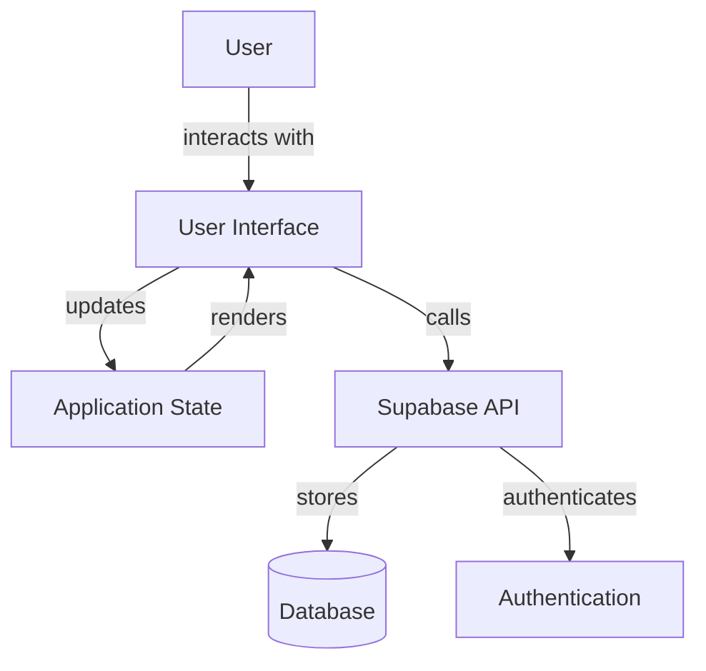

# RightFit Interior Designer - Architectural Document

## 1. Application Overview

RightFit Interior Designer is a professional-grade interior design application built with modern web technologies. It enables users to create, edit, and visualize interior layouts using advanced 2D multi-view planning and immersive 3D visualization.

### 1.1 Purpose

The application serves as a tool for interior designers and homeowners to design various room types including kitchens, bedrooms, bathrooms, media walls, and flooring layouts. The application emphasizes ease of use while providing professional-grade features.

### 1.2 Key Features

- Multi-view 2D planning (plan, front, side views)
- Professional 3D visualization with realistic rendering
- Smart component placement with orientation detection
- Precision measurement tools and grid system
- Enhanced properties panel with context-aware controls
- Extensive component library for different room types
- Cloud-based storage and synchronization
- Secure user authentication

## 2. Technology Stack

### 2.1 Frontend Technologies

- **Framework**: React 18 with TypeScript
- **Build Tool**: Vite
- **Styling**: Tailwind CSS with semantic design tokens
- **UI Components**: shadcn/ui with Radix UI primitives
- **3D Rendering**: Three.js with React Three Fiber and Drei
- **Routing**: React Router v6
- **State Management**: React Context + Hooks
- **Form Handling**: React Hook Form with Zod validation
- **Notifications**: Sonner toast library
- **Animations**: Tailwind animations

### 2.2 Backend Services

- **Authentication**: Supabase Auth
- **Database**: PostgreSQL via Supabase
- **Storage**: Supabase Storage
- **API**: Supabase client library

### 2.3 Development Tools

- **Package Manager**: Bun
- **Linting**: ESLint
- **Type Checking**: TypeScript
- **Version Control**: Git

## 3. Application Architecture

### 3.1 High-Level Architecture

The RightFit Interior Designer follows a modern React-based architecture pattern:



### 3.2 Component Architecture

The application follows a component-based architecture organized into several key areas:

```
src/
├── components/
│   ├── ui/                    # shadcn/ui components
│   └── designer/              # Design-specific components
├── contexts/                  # React Context providers
├── hooks/                     # Custom React hooks
├── lib/                       # Utility functions & security
├── pages/                     # Route components
├── integrations/              # External service integrations
└── assets/                    # Static resources
```

### 3.3 State Management

- **Local Component State**: React's useState for component-specific state
- **Global State**: Context API for auth state and app-wide concerns
- **Form State**: React Hook Form for form handling
- **Persistence**: Supabase for cloud storage of designs

### 3.4 Data Flow

1. User interactions trigger state changes in React components
2. State updates trigger re-renders of UI components
3. Actions that require persistence call Supabase API
4. Database changes trigger optimistic UI updates
5. Real-time updates can be propagated through Supabase subscriptions

## 4. Core Components

### 4.1 Designer Interface

The main `Designer.tsx` component serves as the central hub for the design experience, managing:

- Current design state and history (undo/redo)
- Selected elements and active tools
- View modes (2D/3D) and 2D view types (plan, front, side)
- Integration with validation, keyboard shortcuts, and saving

### 4.2 Design Canvas System

#### 4.2.1 DesignCanvas2D

The `DesignCanvas2D.tsx` component handles:

- Canvas rendering using 2D context
- Element drawing based on current view mode
- User interactions (select, drag, resize)
- Snapping and alignment
- Grid and ruler visualization
- Measurement tools

#### 4.2.2 View3D

The `View3D.tsx` component provides:

- 3D visualization using Three.js and React Three Fiber
- Realistic rendering of room and elements
- Camera controls and lighting
- Material visualization
- Interactive element selection

### 4.3 Component Library

The `CompactComponentSidebar.tsx` component offers:

- Categorized component library
- Room type selection
- Drag and drop interface
- Component filtering

### 4.4 Properties Panel

The `PropertiesPanel.tsx` component provides:

- Context-aware controls based on selection
- Dimension controls (width, depth, height)
- Material and style selection
- Room dimension controls

## 5. Data Models

### 5.1 Design Element

The core data structure for design components:

```typescript
interface DesignElement {
  id: string;
  type: 'wall' | 'cabinet' | 'appliance';
  x: number;
  y: number;
  width: number;
  height: number; // DEPRECATED: Use depth instead
  depth?: number; // Front-to-back dimension
  verticalHeight?: number; // Bottom-to-top dimension
  rotation: number;
  style?: string;
  color?: string;
  material?: string;
}
```

### 5.2 Design

The overall design structure:

```typescript
interface Design {
  id: string;
  name: string;
  elements: DesignElement[];
  roomDimensions: { width: number; height: number };
  roomType: RoomType;
}

type RoomType = 'kitchen' | 'bedroom' | 'bathroom' | 'media-wall' | 'flooring';
```

### 5.3 User and Authentication

User authentication and profile structure:

```typescript
interface Profile {
  id: string;
  user_id: string;
  display_name: string | null;
  avatar_url: string | null;
}

interface AuthUser extends User {
  profile?: Profile;
}
```

## 6. Database Schema

The database is structured around two primary tables:

### 6.1 Profiles Table

```sql
CREATE TABLE public.profiles (
  id UUID NOT NULL DEFAULT gen_random_uuid() PRIMARY KEY,
  user_id UUID NOT NULL UNIQUE REFERENCES auth.users(id) ON DELETE CASCADE,
  display_name TEXT,
  avatar_url TEXT,
  created_at TIMESTAMP WITH TIME ZONE NOT NULL DEFAULT now(),
  updated_at TIMESTAMP WITH TIME ZONE NOT NULL DEFAULT now()
);
```

### 6.2 Designs Table

```sql
CREATE TABLE public.designs (
  id UUID NOT NULL DEFAULT gen_random_uuid() PRIMARY KEY,
  user_id UUID NOT NULL REFERENCES auth.users(id) ON DELETE CASCADE,
  name TEXT NOT NULL,
  description TEXT,
  design_data JSONB NOT NULL DEFAULT '{}',
  thumbnail_url TEXT,
  is_public BOOLEAN NOT NULL DEFAULT false,
  created_at TIMESTAMP WITH TIME ZONE NOT NULL DEFAULT now(),
  updated_at TIMESTAMP WITH TIME ZONE NOT NULL DEFAULT now()
);
```

### 6.3 Row Level Security

The database implements Row Level Security (RLS) policies to ensure:

- Users can only view their own designs and public designs
- Users can only create, update, and delete their own designs
- Profiles are viewable by all but only editable by the owner

## 7. Key Workflows

### 7.1 Design Creation Workflow

1. User selects room type
2. Default room dimensions are applied
3. User can modify room dimensions
4. Elements are added from component library via drag-and-drop
5. Elements are positioned with smart snapping and alignment
6. Properties are adjusted using the properties panel
7. User can switch between 2D views for different perspectives
8. 3D view provides realistic visualization
9. Design validation ensures proper design rules
10. Design is saved to cloud storage

### 7.2 Multi-View Editing

The application supports multiple views of the same design:

- **Plan View**: Top-down layout planning
- **Front View**: Wall-mounted elements and heights
- **Side View**: Depth and profile visualization
- **3D View**: Immersive walkthrough and visualization

Elements are visualized differently in each view with proper depth, height, and position transformations.

### 7.3 Authentication Flow

1. User registers or logs in via Supabase Auth
2. On successful authentication, a user profile is created/retrieved
3. AuthContext provides auth state throughout the application
4. Protected routes require authentication
5. Design persistence is tied to the authenticated user

## 8. Security Considerations

### 8.1 Authentication Security

- Supabase handles secure authentication
- JWT tokens are used for session management
- Passwords are securely hashed and never stored in plaintext
- Row Level Security ensures proper data access

### 8.2 Input Validation

- All user inputs are validated and sanitized
- Design names and data undergo validation
- JSON parsing includes comprehensive error handling
- XSS prevention through safe DOM manipulation

### 8.3 Database Security

- Row Level Security (RLS) on all tables
- User-specific data access controls
- Secure authentication with Supabase
- Leaked password protection enabled

## 9. Performance Considerations

### 9.1 Rendering Optimization

- React.memo for component memoization
- useCallback and useMemo for function and computation caching
- Efficient re-rendering strategies
- Canvas-based rendering for 2D views
- Three.js optimization for 3D rendering

### 9.2 State Management Efficiency

- Localized state where possible
- Context API for global state
- Immutable updates for predictable state changes
- Batched state updates where appropriate

### 9.3 Asset Loading

- Lazy loading of components
- Optimized Three.js models and textures
- Proper cleanup of resources

## 10. Future Architectural Considerations

### 10.1 Scalability

- Component library expansion
- Additional room types
- More detailed 3D models and materials

### 10.2 Feature Roadmap

- Advanced material library
- Lighting simulation
- Cost estimation
- AR visualization
- Collaborative editing
- Export to CAD formats

### 10.3 Technical Debt Management

- Deprecation of height property in favor of depth and verticalHeight
- Cleanup of legacy code paths
- Enhanced performance monitoring
- Improved error handling and recovery

## 11. Deployment Architecture

### 11.1 Development Environment

- Local development with Vite dev server
- Supabase local development

### 11.2 Production Environment

- Static site hosting (Vercel, Netlify, etc.)
- Supabase cloud infrastructure
- CDN for asset delivery
- Environment-specific configuration

## 12. Conclusion

The RightFit Interior Designer application follows modern React best practices with a component-based architecture, efficient state management, and strong integration with Supabase for backend services. The multi-view design system provides a comprehensive interior design experience with both 2D planning and 3D visualization capabilities.

The architecture emphasizes:

- Component reusability and composition
- Clear separation of concerns
- Efficient state management
- Strong typing with TypeScript
- Secure data handling
- Optimized rendering performance

This foundation provides a solid base for future feature development while maintaining performance and security.